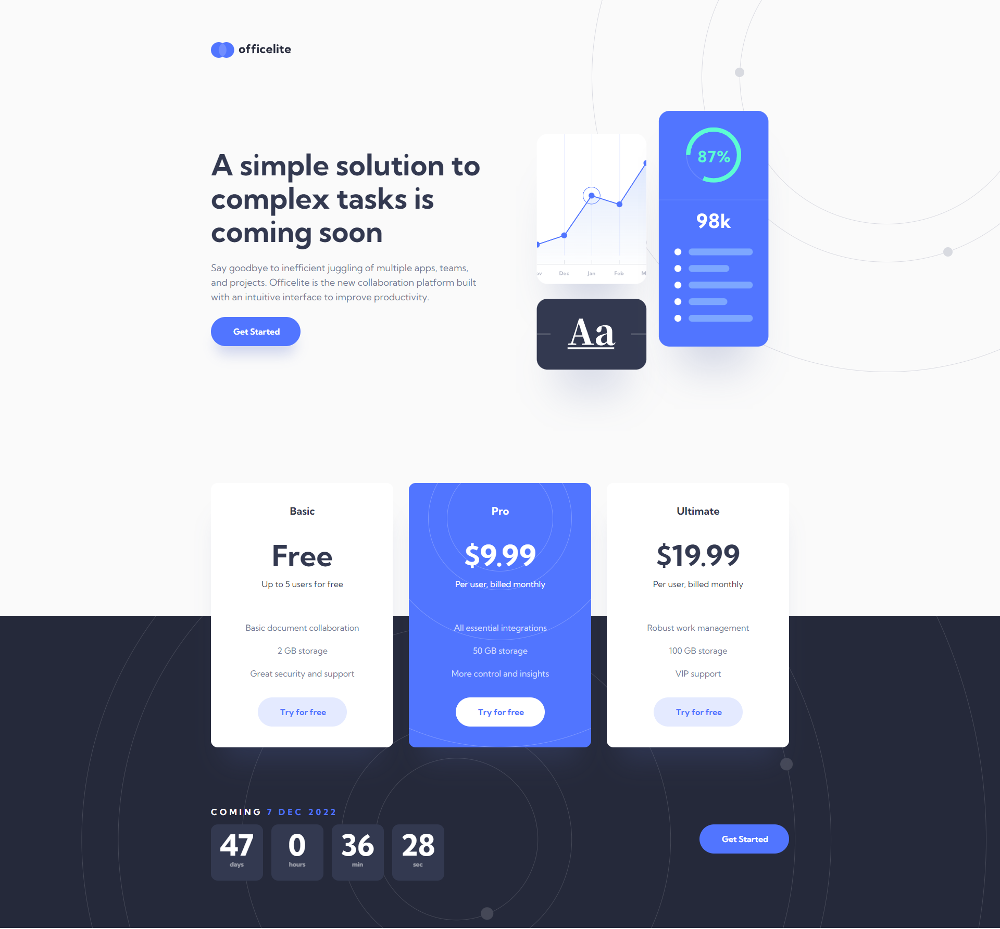
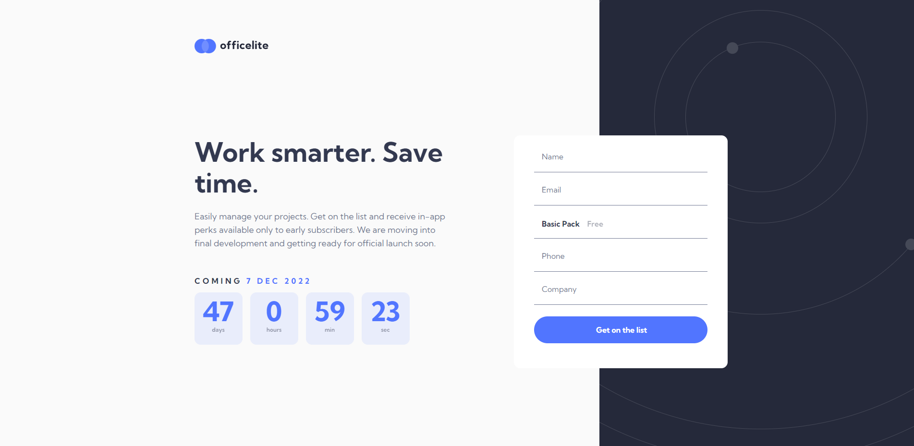

# Frontend Mentor - Officelite coming soon site solution

This is a solution to the [Officelite coming soon site challenge on Frontend Mentor](https://www.frontendmentor.io/challenges/officelite-coming-soon-site-M4DIPNz8g). Frontend Mentor challenges help you improve your coding skills by building realistic projects. 

## Table of contents

- [Overview](#overview)
  - [The challenge](#the-challenge)
  - [Screenshot](#screenshot)
  - [Links](#links)
- [My process](#my-process)
  - [Built with](#built-with)
  - [What I learned](#what-i-learned)
  - [Continued development](#continued-development)
  - [Useful resources](#useful-resources)
- [Author](#author)
- [Acknowledgments](#acknowledgments)

## Overview

### The challenge

Users should be able to:

- View the optimal layout for the site depending on their device's screen size
- See hover states for all interactive elements on the page
- See error states when the contact form is submitted if:
  - The `Name` and/or `Email Address` fields are empty
  - The `Email Address` is not formatted correctly
- **Bonus**: See a live countdown timer that ticks down every second
- **Bonus**: See a custom-styled `select` form control in the sign-up form

### Screenshot




### Links

- Live Site URL: [OfficeLite](https://gitdoppler.github.io/Officelite/)

## My process

### Built with

- Semantic HTML5 markup
- CSS custom properties
- Flexbox
- Mobile-first workflow

### What I learned

The main thing I learned from this project is honestly ... more JavaScript. I really liked that it forced me out of my comfort area, making me study a ton of documentation from MDN on topics like AJAX, Fetch API, Custom Forms, Event Listeners, IntersectionObserver, Clocks (built with js), etc.

- The custom form ( and the star, the custom selector):
```html
<form class="form">
            <div class="name-input">
              <label for="name" class="name-label">Name</label>
              <input type="text" id="name" name="name" class="form-input">
            </div>

            <div class="email-input">
              <label for="email" class="name-label">Email</label>
              <input type="email" id="email" name="email" class="form-input">
            </div>

            <div class="selector">

              <div class="select-box">

                <div class="options-container">

                  <div class="option">
                    <input type="radio" class="radio" id="basic" name="basic">
                    <label for="basic" class="font-label" id="basic-pack">
                      <span class="font-label">
                        Basic Pack
                        <span class="price-line">-</span>
                        <span class="price-pack">Free</span>
                      </span>
                    </label>
                  </div>

                  <div class="option">
                    <input type="radio" class="radio lmao" id="pro" name="pro">
                    <label for="pro" class="font-label" id="pro-pack">
                      <span class="font-label">
                        Pro Pack
                        <span class="price-line">-</span>
                        <span class="price-pack">$9.99</span>
                      </span>
                    </label>
                  </div>

                  <div class="option">
                    <input type="radio" class="radio" id="ultimate" name="ultimate">
                    <label for="ultimate" id="ultimate-pack">
                      <span class="font-label">
                        Ultimate Pack
                        <span class="price-line">-</span>
                        <span class="price-pack">$19.99</span>
                      </span>
                    </label>
                  </div>
                </div>

                <div class="selected">
                  <span class="cock">Select Pack</span>
                  
                </div>
              </div>
            </div>

            <div class="phone-input">
              <label for="phone" class="name-label">Phone</label>
              <input type="tel" id="phone" name="phone" class="form-input">
            </div>

            <div class="company-input">
              <label for="company" class="name-label">Company</label>
              <input type="text" id="company" name="company" class="form-input">
            </div>

            <input type="submit" value="Get on the list" class="btn-1 font-btn-1 btn-sign">

          </form>
```

```js
let open = false;

selected.addEventListener("click", () => {
    optionsContainer.classList.toggle("active");
    console.log(optionsContainer);
    open = true;
});

optionsList.forEach(o => {
    o.addEventListener("click", () => {
        selected.querySelector(".cock").innerHTML = o.querySelector("label").innerHTML;
        optionsContainer.classList.remove("active");
        o.querySelector("input").checked = true;
        selected.querySelector(".arrow").classList.remove("arrow-active");
        open = false;
    });
});

optionsList.forEach((label) => {
    label.addEventListener("mouseover", () => {
        label.querySelector(".price-line").classList.toggle("activated");
        label.querySelector(".price-pack").classList.toggle("name-active");
    });

    label.addEventListener("mouseout", () => {
        label.querySelector(".price-line").classList.remove("activated");
        label.querySelector(".price-pack").classList.remove("name-active");

    });
});

selected.addEventListener("mouseover", () => {
    selected.querySelector(".arrow").classList.toggle("arrow-active", true);
    selected.querySelector(".price-line").classList.toggle("activated");
    selected.querySelector(".price-pack").classList.toggle("name-active");
});

selected.addEventListener("mouseout", () => {
    if (optionsContainer.classList.contains("active") == false) {
        selected.querySelector(".arrow").classList.toggle("arrow-active", false);
    }
    selected.querySelector(".price-line").classList.remove("activated");
    selected.querySelector(".price-pack").classList.remove("name-active");

});
```
The form itself is simple in concept. What's harder is the custom selection, with the hidden options and the ".selected" div which acts as a holder until a value is actually clicked on. The "options' are actually radio buttons which have been stylized based on the design given.

- The option pack animation

```js
const options = {
    root: null,
    threshold: 0.5,
    rootMargin: "0px"
};

const products = document.querySelectorAll(".product");
console.log(products.length);

const observer = new IntersectionObserver((entries) => {
    entries.forEach((entry) => {
        if (entry.isIntersecting) {
            entry.target.classList.add("show");
        } else {
            entry.target.classList.remove("show");
        }

    });
}, options);

products.forEach((item) => {
    observer.observe(item);
});
```

For the triple product animation I used IntersectionObserver since I wanted it to launch only when it was in the line of sight.

- The pre-loader 

```css
.loading {
    display: none;
}

#loader {
    position: absolute;
    left: 50%;
    top: 50%;
    transform: translate(-50%, -50%);
    z-index: 1;
    -webkit-animation: fadeIn 0.5s linear;
    animation: fadeIn 0.5s linear;
}

.loader-img {
    width: 15rem;
}

@keyframes fadeIn {
    from {
        opacity: 0;
    }

    to {
        opacity: 1;
    }
}

@-webkit-keyframes fadeIn {
    from {
        opacity: 0;
    }

    to {
        opacity: 1;
    }
}
```

```js
const elementLoading = document.querySelectorAll(".loading");
function showPage() {
    document.getElementById("loader").style.display = "none";
    elementLoading.forEach((obj) => {
        obj.style.display = "block";
        console.log("auyhwdaw");
    });
};

setTimeout(showPage, 1000);
```

I have also implemented a preloader ( even if it wasn't needed) because I simply taught it will look good.

### Continued development

The only thing which I'm still trying to figure out is how to pass a js variable from js file linked to a html page to another js file linked to another html page.
I did find a workaround ( editing the url ) but I am pretty sure there is a way to directly import. Not sure if it required backend manipulation but I will look into it.

The next objective is diversifying my frontend skills ( learning about Fetch API and other more complex JS features and later on, React). After that I will delve into backend in order to create an interesting web-app.

### Useful resources

- [MDN](https://developer.mozilla.org/en-US/) 

## Author

- Frontend Mentor - [@GitDoppler](https://www.frontendmentor.io/profile/GitDoppler)

## Acknowledgments

I tip my hat to ApplePieGiraffe for the bits of inspiration.
